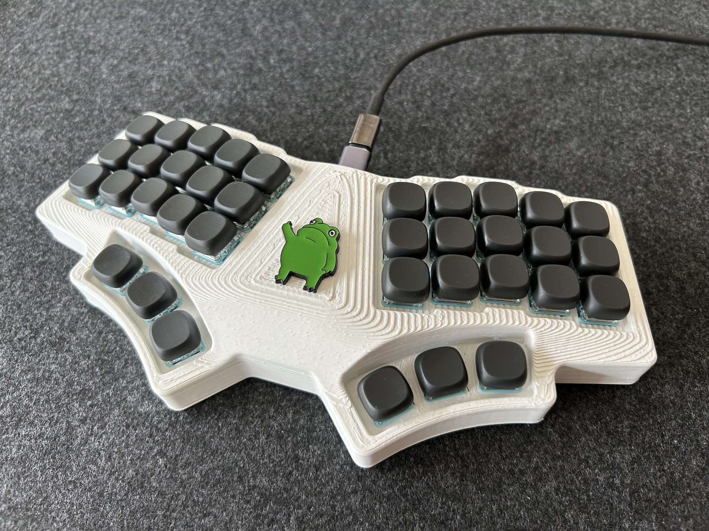
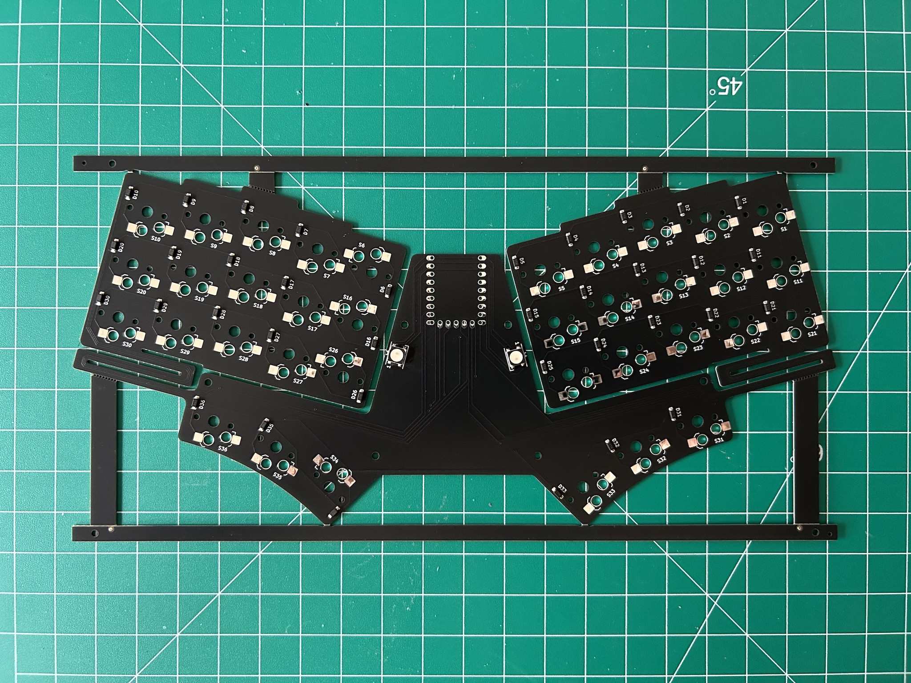
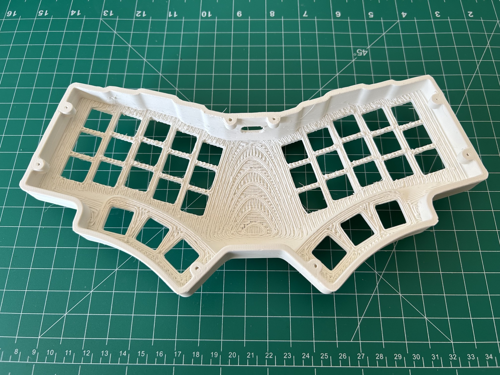
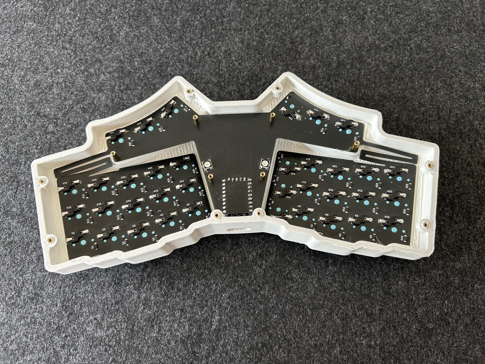
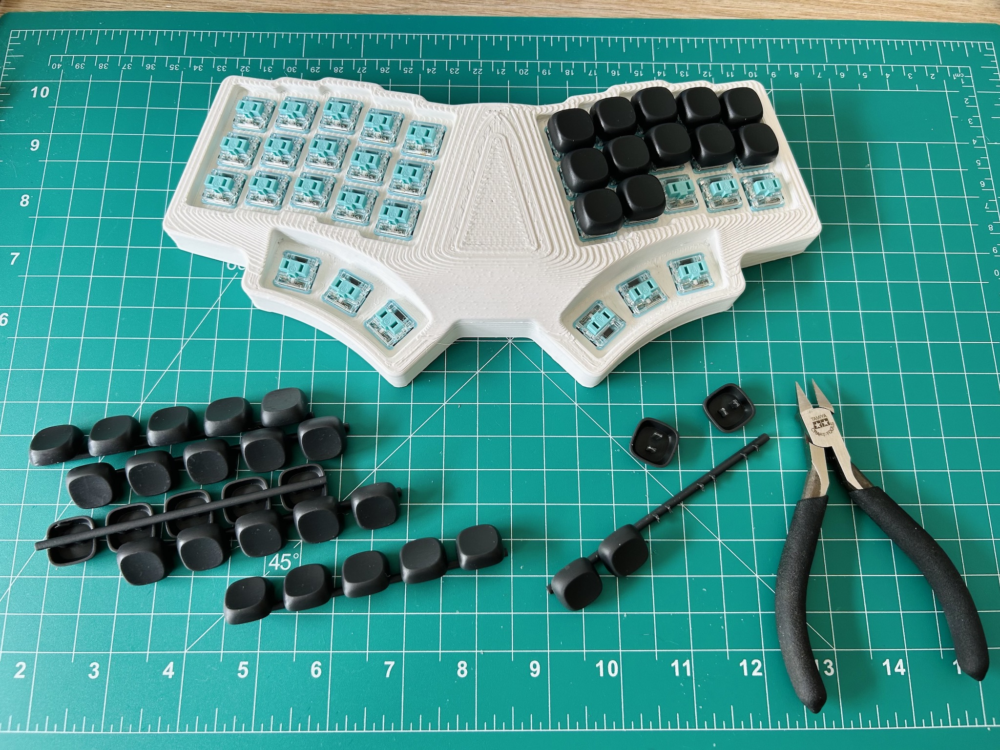

## WeirdFlexButOk 

A hot-swappable unibody ergo split keyboard.

This is inspired by Joe Scotto's handwired [ScottoErgo](https://scottokeebs.com/blogs/keyboards/scottoergo-handwired-keyboard) but opts for Choc spacing and hot-swap sockets, plus a super-bendy 0.8mm PCB with kerf bending cuts. It flexes to follow the case’s contour, providing a 15° tilt and 10° tent from one FR4 PCB. 

## Bill of Materials (BOM)

Quantity | Item 
--- | --- 
1 | RP2040-Zero & Pin headers 
1 | WeirdFlexButOk PCB 
36 | Kailh Choc V1 switches  
36 | Kailh Choc V1 Hot-swap sockets 
36 | 1N4148 diodes (SMD)
2 | WS2812B LEDs (optional, for underglow)
8 | M2x4 heat-set thread inserts
6 | M2x8 standoffs
14 | M2x4 screws 

## Production Files

To place an order for the WeirdFlexButOk PCB:

- Use the Gerber files in the [production/](production/) folder. 
- Optionally, you can utilize the [BOM](production/BOM.csv) and [CPL](production/CPL.csv) files with a PCBA service. All components (except RP2040-Zero) are soldered to the bottom side of the board.

Make sure to select the following specs so the PCB can flex:

- Base Material: `FR4`
- PCB Thickness: `0.8mm` 

The complete PCB design project is in the [kicad/](kicad/) folder. 

## 3D Printable Files 

3D print the case with the provided [STL files](case/). 

|  |  |
|---|---|

There will be a lot of support materials, and the tolerance needs to be tuned right for the switches (14.2x14.2mm) to fit.

I find the following parameters work best for my print:

- Top/Bottom Speed: 30 mm/s 
- Support Structure: Tree
- Fan Speed Override: True
- Support Skin Fan Speed: 100%

## Firmware 

Precompiled VIA-enabled firmware: 

- Flash [penk_weirdflexbutok36_via.uf2](firmware/penk_weirdflexbutok36_via.uf2) to the RP2040-Zero.
- Load the [via.json](firmware/QMK/keyboards/penk/weirdflexbutok36/via.json) file in `Design` tab for [VIA](https://usevia.app) configuration.

## Keycaps

The keycap featured in this image is designed based on the Shiratama profile by [@taneyats](https://twitter.com/taneyats). The original design can be found [here](https://www.taneyats.com/entry/shiratama-profile), and is licensed for non-commercial use under [CC BY-NC 4.0](https://creativecommons.org/licenses/by-nc/4.0).

### Attribution
- **Author:** [@taneyats](https://twitter.com/taneyats)
- **Source:** [Shiratama keycaps](https://taneyats.booth.pm/items/4020198)
- **License:** [Creative Commons Attribution-NonCommercial 4.0 International](https://creativecommons.org/licenses/by-nc/4.0/)

### Derivative Work
The STL file has been modified for Choc spacing and is available here: [Shiratama-choc-1U-set.stl](keycap/Shiratama-choc-1U-set.stl) (Modification by [@penk](https://github.com/penk)).

This adaptation is intended for personal use only.

## Copyright and License
Copyright (c) 2024 Penk Chen. All rights reserved.

All files, except those specifically mentioned as licensed under Creative Commons, are licensed under the MIT license. For more information, see the [LICENSE](LICENSE).
